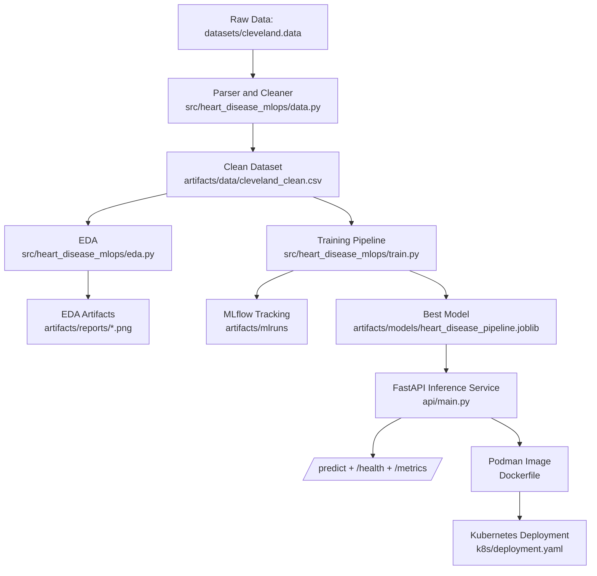

# Heart Disease MLOps Pipeline (Cleveland Dataset)

Production-style end-to-end MLOps implementation for heart disease risk prediction using UCI Cleveland raw data (`datasets/cleveland.data`).

## What This Project Covers

- Raw data parsing from 76-attribute Cleveland format.
- Data cleaning, missing-value handling, and binary target creation.
- EDA artifact generation (class balance, histograms, correlation heatmap).
- Two baseline models: Logistic Regression and Random Forest.
- Hyperparameter tuning + cross-validation + holdout metrics.
- MLflow experiment tracking (params, metrics, models).
- Model packaging (`joblib`) for inference reuse.
- FastAPI serving with `/health`, `/predict`, and `/metrics`.
- Unit tests, linting, and GitHub Actions CI workflow.
- Podman-ready containerization and Kubernetes deployment manifest.

## Architecture Diagram



## Repository Structure

```text
.
├── api/
│   └── main.py
├── datasets/
│   ├── cleveland.data
│   └── heart-disease.names
├── src/heart_disease_mlops/
│   ├── data.py
│   ├── eda.py
│   ├── features.py
│   ├── settings.py
│   └── train.py
├── scripts/
│   ├── bootstrap.sh
│   ├── podman_build_run.sh
│   ├── run_api_local.sh
│   ├── run_training_pipeline.py
│   ├── sample_payload.json
│   └── test_predict.sh
├── tests/
├── k8s/deployment.yaml
├── .github/workflows/ci.yml
├── Dockerfile
├── Makefile
├── requirements.txt
└── .env.example
```

## Quickstart

### 1) Setup

```bash
python3 -m venv .venv
source .venv/bin/activate
pip install --upgrade pip
pip install -r requirements.txt
cp .env.example .env
```

### 2) Run End-to-End Pipeline

```bash
python scripts/run_training_pipeline.py
```

Generated outputs:
- `artifacts/data/cleveland_clean.csv`
- `artifacts/reports/feature_histograms.png`
- `artifacts/reports/class_balance.png`
- `artifacts/reports/correlation_heatmap.png`
- `artifacts/reports/training_metrics.json`
- `artifacts/models/heart_disease_pipeline.joblib`
- `artifacts/mlruns/`

### 3) Start Inference API

```bash
export PYTHONPATH=src
uvicorn api.main:app --host 0.0.0.0 --port 8000
```

### 4) Validate API

```bash
curl http://localhost:8000/health
curl -X POST http://localhost:8000/predict -H "Content-Type: application/json" -d @scripts/sample_payload.json
curl http://localhost:8000/metrics
```

## Podman

```bash
bash scripts/podman_build_run.sh
bash scripts/test_predict.sh
```

## CI/CD

GitHub Actions workflow (`.github/workflows/ci.yml`) performs:
1. Dependency install
2. Lint (`ruff`)
3. Tests (`pytest`)
4. Full training pipeline run
5. Artifact upload

## Kubernetes (Local)

```bash
kubectl apply -f k8s/deployment.yaml
kubectl get deploy,pods,svc
```

## End-to-End Runbook

1) Setup

```bash
python3 -m venv .venv
source .venv/bin/activate
pip install -r requirements.txt
```

2) Train + track + generate artifacts

```bash
PYTHONPATH="src:." python scripts/run_training_pipeline.py
```

3) Run API locally

```bash
PYTHONPATH="src:." uvicorn api.main:app --host 0.0.0.0 --port 8000
```

4) Validate API

```bash
curl http://localhost:8000/health
curl -X POST http://localhost:8000/predict -H "Content-Type: application/json" -d @scripts/sample_payload.json
curl http://localhost:8000/metrics
```

5) Podman build + run

```bash
bash scripts/podman_build_run.sh
bash scripts/test_predict.sh
```

6) CI
- Push to GitHub and verify `.github/workflows/ci.yml` passes.

7) Kubernetes (later)

```bash
kubectl apply -f k8s/deployment.yaml
kubectl get deploy,pods,svc
```

