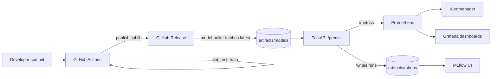

# Heart Disease MLOps Assignment (End-to-End)

End-to-end MLOps reference project for UCI heart disease prediction.
The repository covers data preparation, EDA, model training with
experiment tracking, containerised serving, CI/CD, Kubernetes manifests,
and monitoring. A single `podman compose up` brings the API, MLflow UI,
Prometheus, Alertmanager, and Grafana online.

## Assignment Coverage

| # | Task | Where it lives |
|---|---|---|
| 1 | Data acquisition + EDA visuals | `src/data.py`, `src/eda.py`, `artifacts/reports/*.png` |
| 2 | Two models + cross-validation + metrics | `src/train.py`, `artifacts/reports/training_metrics.json` |
| 3 | MLflow experiment tracking | `artifacts/mlruns/`, MLflow UI at `:5000` |
| 4 | Reproducible packaging | `requirements.txt`, `artifacts/models/heart_disease_pipeline.joblib`, `src/features.py` |
| 5 | CI/CD + automated tests | `.github/workflows/ci.yml`, `tests/` |
| 6 | Containerized `/predict` API | `Dockerfile`, `api/main.py` |
| 7 | Kubernetes deployment manifests | `k8s/deployment.yaml`, `k8s/ingress.yaml`, `k8s/monitoring-stack.yaml` |
| 8 | Monitoring + logging | `monitoring/`, Prometheus `:9090`, Grafana `:3000`, Alertmanager `:9093` |
| 9 | Documentation + report | This `README.md`, plus the report linked under [Submission](#submission) |

## Submission

- **Source code**: this repository
- **Final written report (.docx)**: <add Google Drive link here>
- **Demo video / screenshots**: <add Google Drive link here>

## Architecture



## Quick Start (Single Command Demo)

Prerequisites: `podman` + `podman compose` (or Docker), Python 3.11
only if you want to retrain locally.

```bash
git clone https://github.com/shreyas1925/mlops-assignment.git
cd mlops-assignment
podman compose up -d --build
```

That is it. After ~30 seconds the entire stack is live.

| Service | URL | Notes |
|---|---|---|
| Predict API | http://localhost:8000/docs | Swagger UI for `/predict`, `/health`, `/metrics` |
| MLflow UI | http://localhost:5000 | Browse experiment runs, params, metrics, models |
| Prometheus | http://localhost:9090 | Scrapes the API every 5s |
| Alertmanager | http://localhost:9093 | Alerts triggered by Prometheus rules |
| Grafana | http://localhost:3000 | login `admin` / `admin`, dashboard auto-provisioned |

Smoke test:

```bash
bash scripts/test_predict.sh
```

## How The Model Gets Into The Container

```
GitHub Actions (on push to master)
      |
      | trains model, runs tests
      v
GitHub Release "model-N"
      |
      | model-puller container fetches latest .joblib
      v
artifacts/models/  (shared volume)
      |
      v
api container loads it on startup
```

The `model-puller` service in `compose.yml` is best-effort. If GitHub is
unreachable (offline demo) or no release has been published yet, the API
falls back to the `.joblib` committed in `artifacts/models/`. The demo
never breaks.

## Live Demo Walkthrough (~6 minutes)

Rehearsed sequence that touches every assignment criterion. Capture
screenshots at each step (filenames listed for the report).

### Step 1 - EDA artifacts (30s)

```bash
open artifacts/reports/feature_histograms.png
open artifacts/reports/correlation_heatmap.png
open artifacts/reports/class_balance.png
```

Screenshot: `screenshots/01_eda_visuals.png`

### Step 2 - Models and metrics (60s)

```bash
cat artifacts/reports/training_metrics.json
```

Show Logistic Regression vs Random Forest, CV ROC-AUC, holdout metrics,
selected model.

Screenshot: `screenshots/02_training_metrics.png`

### Step 3 - MLflow experiment tracking (30s)

Open `http://localhost:5000`. Show the `heart-disease-uci` experiment,
both runs, params, metrics, and the logged model artifact.

Screenshots:
- `screenshots/03_mlflow_runs_list.png`
- `screenshots/04_mlflow_run_detail.png`

### Step 4 - Trigger CI on new data (90s)

```bash
echo "67.0,1.0,4.0,160.0,286.0,0.0,2.0,108.0,1.0,1.5,2.0,3.0,3.0,3" >> datasets/processed.cleveland.data
git add datasets/processed.cleveland.data
git commit -m "demo: new patient cohort"
git push
```

Open `https://github.com/shreyas1925/mlops-assignment/actions` and watch
the workflow run live. Once green, a new `model-N` release appears.

Screenshots:
- `screenshots/05_github_actions_running.png`
- `screenshots/06_github_actions_success.png`
- `screenshots/07_github_release_published.png`

### Step 5 - Pull new model and restart api (60s)

```bash
podman compose up -d --build --force-recreate model-puller api
podman compose logs model-puller
```

The puller log will show the new release being downloaded.

Screenshot: `screenshots/08_model_puller_log.png`

### Step 6 - Predict (30s)

```bash
bash scripts/test_predict.sh
```

Screenshot: `screenshots/09_predict_response.png`

### Step 7 - Monitoring (60s)

Generate traffic, then open Grafana:

```bash
for i in $(seq 1 50); do
  curl -s -X POST http://localhost:8000/predict \
    -H "Content-Type: application/json" \
    -d '{"age":63,"sex":1,"cp":1,"trestbps":145,"chol":233,"fbs":1,"restecg":2,"thalach":150,"exang":0,"oldpeak":2.3,"slope":3,"ca":0,"thal":6}' > /dev/null
done
```

Open `http://localhost:3000` (admin / admin) and the auto-provisioned
`Heart Disease API Observability` dashboard.

Screenshots:
- `screenshots/10_prometheus_targets.png`  (http://localhost:9090/targets)
- `screenshots/11_grafana_dashboard.png`
- `screenshots/12_alertmanager_ui.png`     (http://localhost:9093)

### Step 8 - Kubernetes manifests (30s)

```bash
cat k8s/deployment.yaml
kubectl apply -f k8s/deployment.yaml
kubectl apply -f k8s/monitoring-stack.yaml
kubectl get deploy,pods,svc,ingress -A
```

Screenshots:
- `screenshots/13_k8s_deployment_yaml.png`
- `screenshots/14_kubectl_get_all.png`

## Local Retraining (Optional)

Only needed if you want to retrain without going through CI.

```bash
python3 -m venv .venv
source .venv/bin/activate
pip install -r requirements.txt

PYTHONPATH=src python -m pipeline
```

Outputs:

- `artifacts/data/processed_cleveland_clean.csv`
- `artifacts/reports/class_balance.png`
- `artifacts/reports/feature_histograms.png`
- `artifacts/reports/correlation_heatmap.png`
- `artifacts/reports/training_metrics.json`
- `artifacts/models/heart_disease_pipeline.joblib`
- `artifacts/mlruns/`

## Kubernetes Deployment

Manifests are kept for the assignment's deployment criterion. Apply on
any local cluster (Docker Desktop K8s, Minikube, kind):

```bash
kubectl apply -f k8s/deployment.yaml
kubectl apply -f k8s/monitoring-stack.yaml
kubectl apply -f k8s/ingress.yaml      # optional, requires nginx ingress
kubectl get deploy,pods,svc,ingress -A
```

NodePorts (when not using ingress):

- API: http://localhost:30080/health
- Prometheus: http://localhost:30090
- Grafana: http://localhost:30300

## API Contract

```bash
curl http://localhost:8000/health

curl -X POST http://localhost:8000/predict \
  -H "Content-Type: application/json" \
  -d '{"age":63,"sex":1,"cp":1,"trestbps":145,"chol":233,"fbs":1,"restecg":2,"thalach":150,"exang":0,"oldpeak":2.3,"slope":3,"ca":0,"thal":6}'

curl http://localhost:8000/metrics | head
```

Response shape:

```json
{ "prediction": 1, "confidence": 0.83 }
```

## Quality Gates

```bash
make lint
make test
```

CI runs on every push and PR:

1. `pip install -r requirements.txt`
2. `ruff check .`
3. `pytest -q`
4. `python -m pipeline`  (regenerates model + EDA + MLflow runs)
5. uploads `artifacts/` as a workflow artifact
6. on `master`, publishes a GitHub Release with the model attached

See `.github/workflows/ci.yml`.

## Repository Layout

```text
.
|-- api/main.py                 FastAPI service
|-- src/
|   |-- data.py                 dataset parsing + cleaning
|   |-- eda.py                  EDA artifact generation
|   |-- features.py             preprocessor pipeline (scaler + encoder)
|   |-- train.py                LR + RF training, CV, MLflow tracking
|   |-- pipeline.py             one-shot: data -> EDA -> train
|   |-- settings.py             paths and env config
|-- artifacts/                  generated outputs (committed for demo)
|-- datasets/processed.cleveland.data
|-- monitoring/
|   |-- prometheus/             scrape config + alert rules
|   |-- alertmanager/           alert routing
|   |-- grafana/                provisioned datasource + dashboards
|-- k8s/                        deployment, ingress, monitoring stack
|-- tests/                      pytest suite
|-- scripts/test_predict.sh     curl-based smoke test
|-- compose.yml                 single-command full stack
|-- Dockerfile                  API image (model is volume-mounted)
|-- .github/workflows/ci.yml    lint + test + train + release
```
